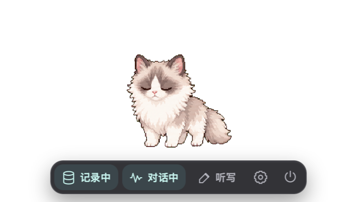
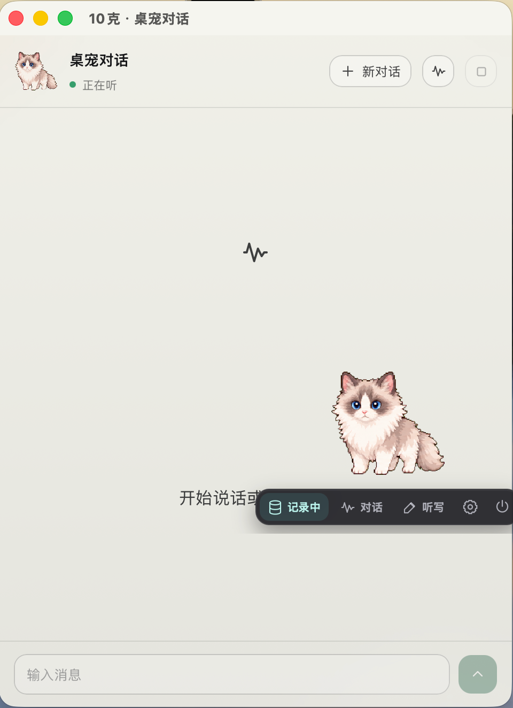
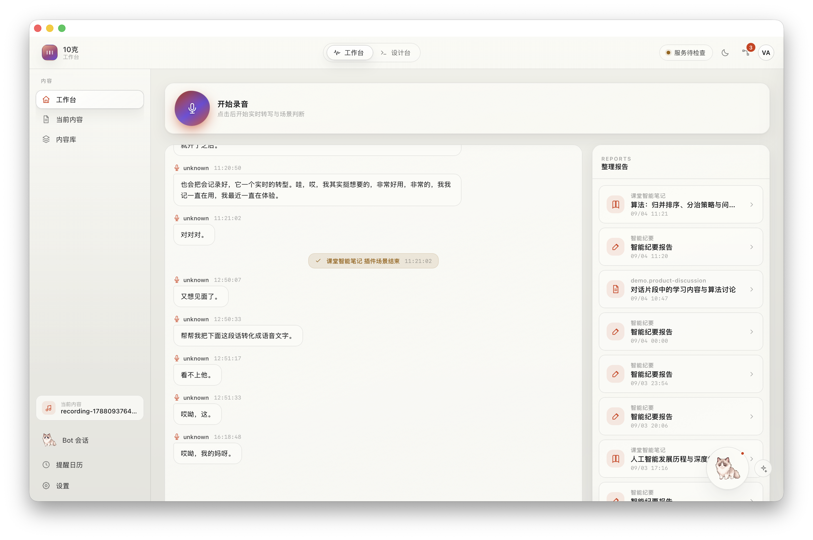

# 时刻 · 作品简介

## 背景和愿景

人类产生信息最密集的时刻是口头交流的过程：一场讨论、一次授课、一段问诊、一轮头脑风暴，最有价值的内容几乎都是在言语表达中产生的。但也正是这些内容流失得最彻底。这种流失来自两个相互叠加的困境。

其一，产出和记录之间存在着巨大的速度和成本差。口头表达可以达到每分钟两三百字，而手写记录只有几十字。更关键的是：记录和思考争夺的是同一份注意力。记录过程中恰好错过了下一句话，专注倾听时又什么都没留下；于是记录永远是残缺的——要么只记了开头，要么留下一堆语焉不详的关键词，事后自己都难以理解。

其二，记录的信息难以被真正有效利用。相机、录音笔早就商品化了，可记下来之后呢？两小时的录音难有人重听，万字逐字稿难有人重读，手机中大量的照片在拍摄后就再没看过第二眼。它们被存进一个再也不会打开的文件夹——我们称之为”记录墓地”。存储解决了”留下”的问题，却没有解决”用上”的问题，而决定记录工具价值的从来不是采集的便利性，而是其产出被利用的概率。真正的瓶颈在于关键的一步：把口头表达转化为可实际使用的知识，这一步目前尚无完善的解决方案。

回顾人类文明的历史，每一次知识积累效率的跃迁都伴随着记录技术的跃迁：文字让经验跨越了个体的生命，印刷让知识跨越了阶层，录音和录像让”此刻”可以被无限次再现。但这些技术降低的都是”保存”的成本，”整理”——把原始信息变成结构化的、可调用的知识——从来没有被技术解放过，它一直是”手工业”，每一份纪要、每一页笔记都需要人用注意力逐字敲出。

当前的记录和整理，就是信息时代的手工制造。它消耗注意力，产出不稳定，且与思考、表达、讨论等核心活动直接冲突。而 AI 对自然语言的理解能力已发生质变：把对话压缩成结构化信息，技术上已经可行。缺少的是认真的实现——理解不同场景的实际需求，把”整理”彻底自动化。

当记录和整理自动完成，人就从中解放出来。使用者无需在”认真听”和”认真记”之间做选择，无需在会后花时间写可能不会再看的纪要。唯一需要做的是：把话说好，把问题想清楚。

这就是MemoCat的目标。近期，我们在校园场景中验证了”自动录音转写 → 自动整理 → 高效利用”这条路径；未来，我们让每个人用自然语言定义自己的整理方式，让系统不断学习用户习惯；长期，我们希望”智能整理”成为如录音设备般普及的基础设施——如水电般无处不在、润物无声。当人们在说话、思考、讨论时，那些零碎但有价值的内容被自动整理，存入个人知识库，随时调用。将”人工整理思维”转变为”AI 自动完成”，将凭借人的记忆力回忆转化为在和ai聊天的时候自动唤醒你的记忆，并希望在未来可以帮助人们去完成一些事情使人类文明积累知识的效率再上一个台阶。

---
## 竞品情况以及创新点

市场上已有不少语音记录与整理产品，如飞书妙记、讯飞听见、通义听悟、Otter.ai、Notion AI 会议纪要等，均可实现语音转写、摘要提取和关键词识别。这些产品在转写准确性和排版规范性上表现良好，但存在一个结构性缺陷：整理模块采用封闭式设计，以统一规则处理所有用户和场景。

然而，整理需求本质上具有场景依赖性。数学课堂需要定理推导与公式，产品讨论需要决策点与待办事项，科研组会需要进展追踪与计划安排。通用模板难以满足这种差异化需求。

事实上，越通用的整理，越像一份面面俱到但毫无重点的逐字稿缩写——它记录了所有内容，却没有回答任何一个具体用户真正关心的问题。这就是为什么用户对这类产品的普遍反馈是"内容是合理的，但事实上难以真正被利用"。录了、转了、整了，最后还是不看。产品完成了从录音到文字的转换，却没有完成从信息到知识的转换。记录墓地只是换了一种格式继续堆积。

MemoCat要打破的正是这个诅咒。我们的核心创新不在于转写更准或摘要更好，而在于：**整理规则是个性化的，而不是我们预设的。** 具体来说，时刻的差异化体现在三个层面：

**第一，极高的可定制化。整理方式定根据每个现实场景重新定义，而不是由产品预设。** 用户可以根据需求：每周三有组会，想要每个人的进展和下周计划，定制一个只关注这些维度的整理插件。数学课和产品讨论用不同的插件，不同的人对同一种会议也可以有不同的插件。**确保不同场景下只记录用户最想要的少量高质量信息。**

**第三，全新的桌面形式**，我们追求的不再是臃肿的前端，我们希望这一切都是无感，所以，宠物的设计就是最佳的Idea，全程无感，你看到的只是你的MemoCat在陪着你学习，生活，并为你记录生活中的一切。

**第四，从Realtime对话到Memory到Harness的完整打通**，我们不是说仅仅做了一个会对话的agent系统，我们是打通了整条的生产链路，Memocat记录着你生活中的日常，我们坚信如果一个AI的输入可以无限的接近我们的生活，那他就可以建模你的用户画像。我们希望通过这种方式，通过Harness的底层优势，来实现一个可以为你处理杂事，帮你记录生活的Agent助手

**第五，记录，语音转写的打通**，用户不再需要因为要实现的功能不同，所以要去切换软件。用户完全可以通过MamboCat的前端简易的按钮和快捷键去实现他想要的不同的功能。

## 产品描述

### 产品形态

时刻本身就是你电脑桌面角落的一只猫。安装之后屏幕角落会出现一只小小的布偶猫（你也可以个性化的更换成其他桌宠形态），透明背景不占地方可以拖到任何位置，它是整个系统唯一的入口，你不需要打开任何窗口也不需要学任何操作。

使用方式极其简单：按一下它开始听，再按一下它停下来。你可以用蓝牙麦克风或直接用电脑和收集的麦克风，开启后把软件放到后台就能忘掉它的存在。开始工作之前按一下，后续的一切都不需要你管。

它也有自己的dashboard。在这里你可以浏览所有的整理报告按时间线或场景类型筛选，可以全文检索任何说过的话并跳转到原始对话甚至原始录音，可以管理你的整理插件、查看和训练声纹库、处理待审批的事项。Dashboard不是必须打开的东西，只有当你需要回溯、检索或调整系统行为时才会用到，日常使用中那只猫就足够了。

![[Pasted image 20260904162057.png]]

### 产品功能
1. 无感语音记录，桌面常驻麦克风采集，后台持续本地转写（MiMo ASR / Qwen Filetrans）
	- 你无需主动切换场景，后台的算法会自动化的帮你识别场景，调用你已有的结构化报告的整理方式，帮你生成结构化的报告
2. 自动判定场景，以及结构化报告的可定制化，产出结构化可追溯的报告：
	- 课堂智能笔记（核心概念 / 老师强调 / 易错点 / 课后作业 / 疑问）
	- 会议纪要（决策 / 待办）
	- 组会（组员摘要 / 导师点评 / 下一步行动）
	- 讲座启发产品讨论
3. **长期记忆（本地 + 云端）**，提供本地存储和云端存储两种存储方式，为用户提供隐私化的选项，同时支持跨时间跨语义召回，而且在与桌宠对话的过程中，它可"回忆"过去内容（通过调用 recall_memory函数来检索本地或者云端的memory）来为用户提供更有用更细致更可定制化的回答
4. **待办与日历提醒**
	- Agent会自动的从对话/会议自动提取 Action Item（带优先级、截止时间），并在后台的提醒日历打点、建立当日列表、并提供新建/改期/开关等修改的功能，并在未来按照你规定的时间或者自动提取的时间提前提醒你。
5. **桌宠语音助手**
	- 常驻桌宠（可换皮肤），语音对话（Qwen Realtime 实时全双工）,同时可以调用基础的工具，如Recallmemory来回忆一些内容，-通过 spawn_thinking 委托后台 Hermes等主流agent 干复杂任务，同时给予动作反馈（聆听/思考/回答/工作状态）
	- 通过调度算法和后台任务，可以实现干活不影响聊天，聊天也不影响干活，支持后台多任务并行和串行
6. 提供管理界面
	- 内容库 / 报告详情 / Packages 组织包设计器 / 运行记录 / 数据谱系应有尽有，我们不是说完全摒弃传统的后端，而是做了一个tradeoff，保留可定制性，同时通过桌宠的前端来确保使用时的无感
7. **记录，语音转写的打通**，用户不再需要因为要实现的功能不同，所以要去切换软件。用户完全可以通过MamboCat的前端简易的按钮和快捷键去实现他想要的不同的功能。
8. 支持导入专业的热词和文档
9. md渲染
10. 智能整理的todo
11. 声纹识别，多人声识别
12. 

### 产品结构

时刻的核心是一条自动化的信息处理流水线，将口头表达转化为结构化知识。这条流水线由五个紧密协作的层次构成，每一层都专注于解决信息转化过程中的一个关键问题：

**语音采集层**：系统通过语音活动检测（VAD）技术持续监听音频输入，自动识别有效语音片段并过滤环境噪音和静音。检测到的语音片段会被智能分段：连续讲话超过12秒时自动切分，停顿超过1.2秒即封块送转写，短于0.5秒的噪声片段被丢弃。所有原始音频按内容哈希在本地存储，为后续的溯源和回听提供基础保障。

**音频转写层**：分段后的音频被送入云端 ASR 语音识别模块，完成语音到文字的高精度转换，输出带时间戳的文本。与此同时，本地运行的声纹识别模型对每个语音片段提取256维声纹向量，通过余弦相似度匹配说话人身份。系统维护一个声纹库。转写结果、时间戳、说话人标签三者统一存入时间线数据库，形成完整、可检索的对话记录。

**场景判断层**：场景判断模块以轻量、高频的方式持续监测对话内容，每积累10句话或间隔45秒就进行一次判断，识别当前对话属于什么场景类型（课堂笔记、会议讨论、产品设计、问诊记录等）。从而判断哪些整理插件需要触发。

**智能整理层**：当场景确认结束后，系统自动加载对应的整理插件并触发整理流程。整理引擎根据插件中定义的提示词、输出Schema和处理规则，调用大语言模型将原始对话按照格式要求压缩为结构化报告。

**记忆系统层**：整理报告与原始对话记录双路存入本地记忆库。记忆库基于 SQLite 构建，原始对话表支持 FTS5 全文索引，整理报告表存储结构化字段，两者通过句子编号建立精确关联。当用户检索时，系统同时召回原始记录和整理报告，优先从整理报告中提取答案，但所有答案必须标注出处，支持一键跳转到原始对话甚至原始录音。系统支持可选接入远端长期记忆服务（MemOS、OpenMem 等），通过语义向量检索提供跨时间跨场景的关联召回能力。

> ［插图：整理报告截图。］

---

## 核心功能一览

| 模块 | 功能 |
|---|---|
| 实时转录 | 后台监听、语音活动检测分段、云端转写、说话人识别与声纹库、统一时间线存储 |
| 智能整理 | 大模型场景判断 + 时间确认状态机、场景结束自动触发、结构化报告、溯源硬校验 |
| 检索与记忆 | 全文检索、原始记录与整理报告双路召回、带出处作答、提问日志回流 |
| 实时语音 Agent | 流式语音对话、随时打断、记忆召回、提醒与待办、复杂任务委派后台 Agent |
| 语音输入法 | 按需录音、转写后直接插入当前应用光标处，失败时降级为粘贴 / 复制 |
| 桌宠入口 | 透明常驻、悬停工具条、必要时气泡（审批 / 任务 / 提醒）、皮肤可换 |
| 内置整理插件 | 课堂智能笔记、会议纪要、通用整理、问诊记录、产品讨论 |
| 插件创作 | 手动创建整理插件、编译校验、历史对话回放测试、可视化工作流编辑器 |
| 自进化 | 反馈信号收集、改进提案生成、新旧版本回放对比、审核生效、一键回滚 |

---

## 技术实现

### 技术栈

时刻是一个本地优先的桌面系统。所有原始音频、声纹、对话记录、整理报告和 Agent 状态都留在用户自己的电脑上；只有需要模型处理的文本和音频片段会被送到云端。

| 层 | 选型 |
|---|---|
| 后端 | Rust，25 个 crate 组成的工作区；`tokio` 异步运行时，`cpal` 音频采集，`webrtc-vad` 语音活动检测，`rusqlite` 本地存储，`reqwest` 调用云端模型，`ort` 运行本地 ONNX 模型 |
| 桌面壳 | Tauri 2——透明无边框、置顶、不抢焦点的桌宠窗口；原生 IPC 二进制通道传输音频 |
| 前端 | React 19 + TypeScript + Vite |
| 存储 | 本地 SQLite ×7：统一对话时间线、记忆库（FTS5 全文索引）、声纹库、提醒调度、审批记录、Agent 会话、应用状态；音频按内容哈希落盘 |

### 使用的模型与 API 调用方式

| 环节 | 模型 | 提供方 | 调用方式 |
|---|---|---|---|
| 语音识别 | Qwen3-ASR-Flash（`qwen3-asr-flash`） | 阿里云百炼 DashScope | OpenAI 兼容 REST：`POST /compatible-mode/v1/chat/completions`，音频以 `input_audio`（base64 WAV）随消息传入，返回带时间戳与说话人分组的句子列表；可选切换到 DashScope 异步文件转写端点（`X-DashScope-Async` 提交 + 任务轮询），支持长音频与说话人分离 |
| 实时语音对话 | Qwen-Audio 3.0 Realtime Plus（`qwen-audio-3.0-realtime-plus`） | 阿里云百炼 DashScope | WebSocket：`wss://dashscope.aliyuncs.com/api-ws/v1/realtime`，双向 PCM 流（16 kHz 入 / 24 kHz 出），文字与语音双模态输出，服务端 `smart_turn` 断句；通过 Function Calling 注册 6 个工具（记忆召回、记忆写入、提醒、待办列表、待办更新、后台任务委派）；`response.cancel` 实现随时打断 |
| 场景判断 | DeepSeek Chat（`deepseek-chat` / `deepseek-v4-flash`，可配置） | DeepSeek | REST：`POST /v1/chat/completions`，`response_format: json_object`；把所有已装载插件的判断规则拼进同一次调用，每积累 10 句或 45 秒判定一次，输出 `{action, plugin, sceneId, reason}` |
| 结构化整理 | 同上 | DeepSeek | 同上；System Prompt = 插件的整理指令 + 输出 JSON Schema，User = 带句子编号的原始对话；输出先经本地 Schema 校验与溯源校验，失败时把错误信息作为对话追加回模型定向修复；每次整理的模型调用预算（2–3 次）写在插件清单里 |
| 插件生成 / 进化提案 | 同上 | DeepSeek | 同上；自然语言 → 插件 YAML，必须通过编译器校验，编译错误回喂模型重生成，最多 3 轮 |
| 检索问答 | 同上 | DeepSeek | 同上；分两步：查询理解（自然语言 → 时间 / 说话人 / 场景过滤条件）与答案合成（只允许使用检索命中的内容）；无密钥或网络失败时退回确定性答案，不阻塞检索 |
| 说话人识别 | CAM++（ModelScope `iic/speech_campplus_sv_zh-cn_16k-common`，转 ONNX） | 本地 ONNX Runtime | 进程内推理：80 维 Fbank 特征 → 256 维声纹向量 → 余弦相似度；正式声纹 0.90、临时声纹 0.85 双阈值；临时声纹累积足够时长后自动升级入库 |
| 语音活动检测 | WebRTC VAD | 本地 | 30 ms 帧；停顿 1.2 秒即封块送转写，连续讲话 12 秒硬切，短于 0.5 秒的块丢弃 |
| 复杂任务后台 Agent | Hermes（本地 Agent 框架，子进程） | 本地 | ACP 协议（JSON-RPC over stdio）：`initialize → session/new → session/prompt`，事件流回传；通过 MCP 向其暴露 5 个只读记忆库工具（搜索、读取、反链、相关、取源）；写操作一律经审批桥，用户在桌宠气泡上批准或拒绝 |
| 远端长期记忆（可选） | MemOS / OpenMem | memtensor | REST；精准召回阈值 0.70，且命中必须能回落到本地仍然有效的证据位置 |

所有密钥通过独立的凭证保管库管理，与非敏感配置分离；密钥只用于构造请求头，不进入界面、日志、执行计划、运行记录或任何测试输出。每个模型环节都可以通过环境变量替换端点与模型名，兼容 OpenAI 格式的自建网关。
