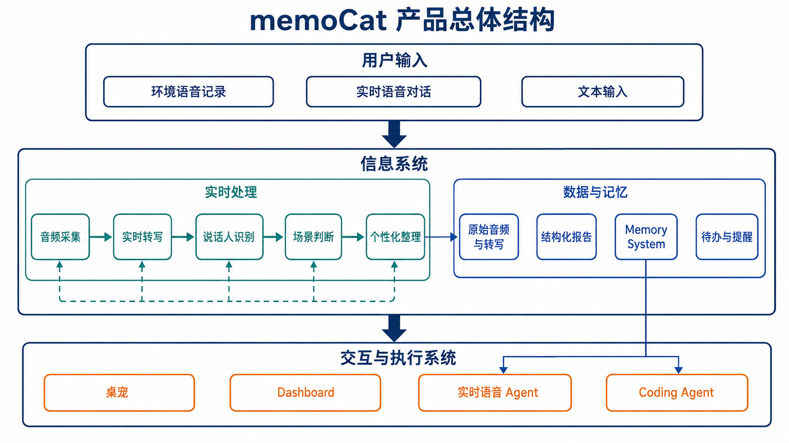
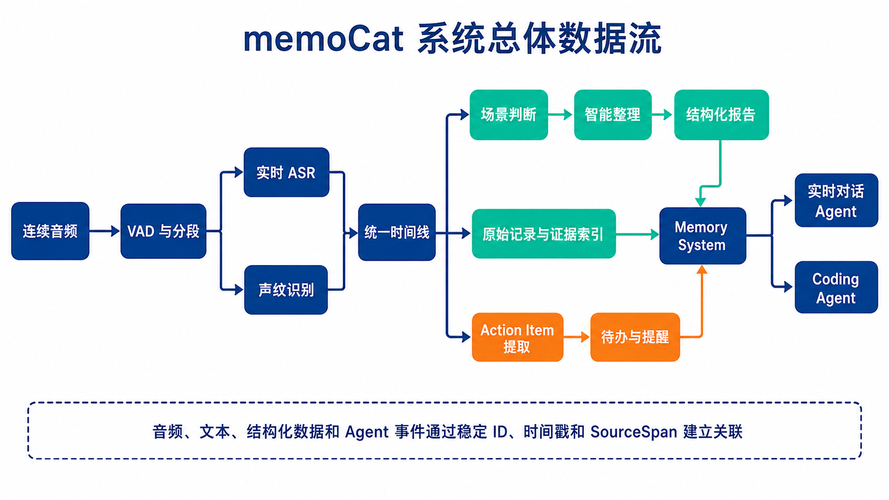
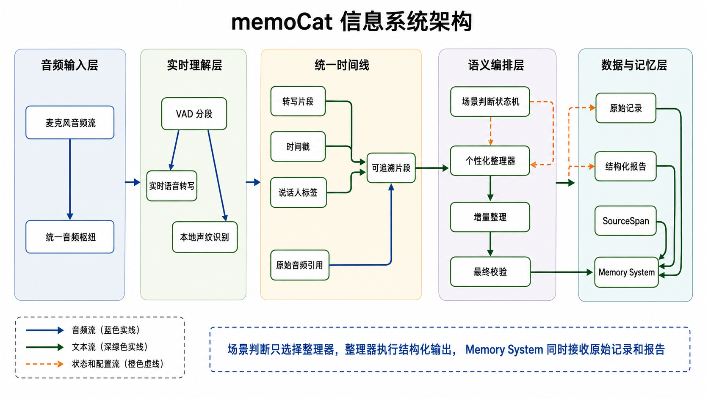
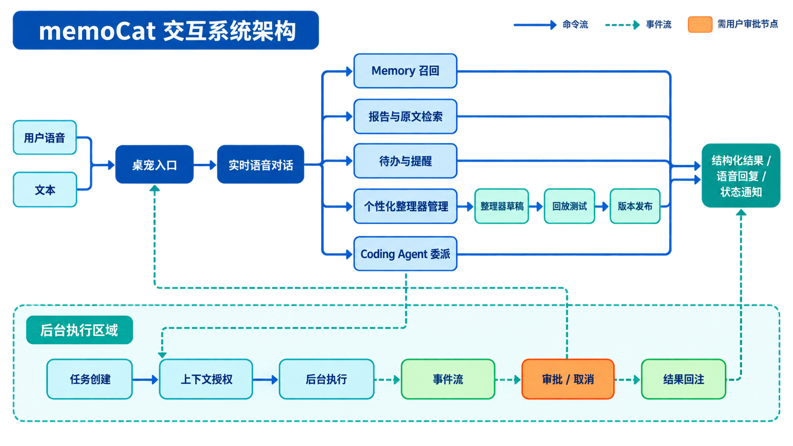

# memoCat · 设计文档

> 本文面向项目评审、产品设计和工程实现。文档保留五个主部分：项目概述、设计思路、技术架构、功能模块、关键技术难点。技术架构描述系统中信息如何流动，功能模块进一步说明各能力的具体实现。

---

## 1 · 项目概述

memoCat 是一个常驻桌面的个性化语音记录、整理、记忆与 Agent 助手。它通过统一的麦克风入口接收用户在课堂、会议、工作和日常生活中的语音，把连续的自然表达转化为带时间、人物和来源信息的文本，再生成符合用户需求的结构化内容。

现有语音产品已经能够完成实时转写和统一整理，但整理结果通常依赖固定模板，无法充分适应不同用户在不同场景下的关注重点。memoCat 的核心目标，是让用户能够定义自己的整理方式，并让记录内容继续进入 Memory 和 Agent：过去说过的话不仅可以被保存，还可以被检索、回忆和转化为行动。

产品最终形成一条连续链路：

```text
自然表达 → 实时转写 → 场景判断 → 个性化整理 → Memory → 对话召回 → Agent 执行
```

---

## 2 · 设计思路

### 2.1 设计原则与需求推导

我们根据用户的真实需求推导出我们的产品的设计原则，从而得出我们需要的产品结构。

**无感记录。** 用户在课堂、会议、工作和日常思考中，最重要的是保持表达和交流的连续性。如果记录需要频繁打开窗口、选择模式、确认分段或手动整理，记录本身就会变成新的注意力负担。因此，系统应当把采集、转写和整理放到后台运行，让用户只承担必要的开始、停止或确认操作。由此，我们需要一个常驻桌面的轻量入口，以及一个能够持续运行的后台信息系统。

**个性化优先。** 不同场景需要保留的信息并不相同，同一场会议中的不同参与者也可能有不同的关注重点。课堂需要概念、推导和作业，组会需要成员进展和下一步计划，产品讨论需要决策、分歧和待办；固定模板无法覆盖这些差异，通用摘要也很难保证结果真正有用。因此，系统不能把整理规则写死，而应允许用户定义自己关心什么、结果如何组织以及何时触发。由此，我们需要将场景判断与智能整理分开，并提供可创建、可修改、可测试和可版本化的个性化整理器。

**全链路流式。** 语音记录往往持续较长，如果必须等录音结束后才开始转写和整理，用户既要承受等待，也无法及时发现内容是否被正确理解。实时转写只能解决文字尽快出现的问题，还需要让转写结果继续驱动场景判断和整理，使重点、结论和待办在内容产生过程中逐步形成。因此，系统需要维护音频流、文本流、场景状态流和整理结果流，并在场景结束时完成最终确认、校验和归档。

**结果可追溯。** 一份看起来完整的摘要，如果无法说明结论来自哪段原话，就很难用于复盘、决策和后续行动。尤其是责任人、截止时间和会议决策等信息，必须能够回到具体的时间、说话人和原始音频。由此，系统需要让原始音频、转写片段、说话人标签、报告字段和行动项通过稳定 ID 与 SourceSpan 建立关联，任何整理结果都不能脱离原始记录独立存在。

**本地优先。** 语音、声纹和日常对话包含大量个人信息，产品必须在保证隐私和长期可用的前提下使用云端模型能力。原始数据和关键状态不能依赖某一次网络请求或某个固定服务，模型服务也应当可以替换。因此，系统需要将音频、声纹、对话、报告和任务状态默认保存在本地，通过 Provider 接入外部模型，并为无网络、无密钥和服务失败定义明确的降级行为。

**从理解到行动。** 如果系统只能把对话整理成一份报告，用户仍然需要自己重新阅读、提取任务并安排后续工作，记录和行动之间依旧存在断层。真正有价值的系统应当能够从历史记录中召回相关内容，并在用户授权后用于创建提醒、更新待办、整理资料或启动 Coding Agent。因此，系统需要把结构化记录进一步沉淀为 Memory，并通过统一的工具和任务接口连接实时对话与后台 Agent。

这些原则共同决定了 memoCat 的基本形态：它不是一个孤立的录音或摘要工具，而是一套让信息从产生流向理解、保存和行动的系统。由此，产品可以抽象为两个相互连接的部分：负责采集、转写、判断和整理的信息系统；负责桌宠、对话、工具调用和 Agent 执行的交互与执行系统。

### 2.2 初步产品结构

根据上述设计原则，memoCat 可以先抽象为两个相互连接的系统。

**信息系统**负责从接收连续音频到保存、索引和召回信息的完整过程：包括音频分发、VAD 分段、语音转写、声纹识别、场景判断、智能整理、原始记录保存和 Memory 索引。它既产生不断更新的音频片段、转写片段和整理结果，也保证报告和回答可以回到原始依据，并为交互系统提供统一召回接口。

**交互与执行系统**负责让用户使用这些能力：包括桌宠、实时语音对话、整理器管理、待办提醒、Dashboard 和 Coding Agent。它既可以查询信息系统产生的内容，也可以向信息系统写入用户确认后的信息。

两者的关系见下图：



---

## 3 · 技术架构

### 3.1 总体结构

memoCat 由信息系统、交互系统两部分组成。信息系统将连续的音频转换成带时间、人物和场景信息的结构化内容，保存这些内容，并建立原始证据、报告、Memory 和行动项之间的关联；交互系统向用户和 Agent 提供查询、对话、配置和执行能力。

从数据角度看，系统处理的是多种模态信息：原始音频是证据，转写文本是可计算内容，声纹是人物线索，场景状态是编排依据，结构化报告是面向用户的结果，Memory 是跨时间召回的索引，Agent 事件是面向行动的状态。每种信息都保留自己的生命周期，同时通过稳定 ID 和来源引用建立关联。

系统的基本流动关系见下图：



### 3.2 信息系统架构

信息系统负责把连续产生的多模态信息组织成可理解、可保存、可召回的内容。它是一条持续运行的信息流：音频进入后形成转写文本和说话人线索，二者汇入统一时间线；场景判断根据时间线选择整理方向，智能整理生成结构化结果；原始记录、报告、行动项和 Memory 索引在同一系统内关联保存。

信息系统中的各类对象通过片段 ID、时间戳、场景 ID 和来源引用保持对应。音频是原始证据，转写是可计算内容，声纹提供人物维度，场景状态决定处理上下文，整理器决定输出结构。中间结果可以持续更新，确认结果进入持久化存储，失败事件也沿同一链路记录。



### 3.3 交互系统架构

交互系统负责把信息系统提供的记录、检索和记忆能力转化为用户操作，并把用户意图转化为命令或后台任务。桌宠和 Dashboard 负责呈现，实时对话负责调度，信息系统与后台 Agent 负责执行。

桌宠承担快速入口和即时反馈，Dashboard 承担报告回溯、原文检索、整理器设计、声纹与 Memory 管理以及任务跟踪。两者共享同一套后台状态：界面发出命令，系统通过状态事件返回处理进度和结果。

实时语音对话是主要调度入口。前台 Agent 根据意图调用 Memory、报告检索、待办提醒和整理器管理；长时间或高权限任务则创建 Coding Agent 后台任务。前台保持低延迟，后台通过事件流返回进度、审批请求和最终结果。

交互系统区分命令流和事件流。只读查询可以直接完成，改变数据或访问项目环境的操作经过权限和审批；整理器由交互系统管理版本，由信息系统在记录处理中执行。



### 3.4 技术栈与方案选择

memoCat 需要长期运行在用户电脑上，因此技术选型围绕稳定性、实时性和本地能力展开。底层使用 Rust 作为本地 Host，负责音频采集、流式处理、任务调度、数据保存和系统权限。Rust 适合管理长期运行的进程和并发任务，也便于在网络中断、模型失败或重启后恢复关键状态。

桌面端采用 Tauri。memoCat 需要透明窗口、系统托盘、全局快捷键、麦克风权限和跨应用文字插入，这些能力依赖操作系统。Tauri 允许使用 Web 技术构建桌宠和 Dashboard，同时通过 Rust 提供原生接口。React 和 TypeScript 用于前端，以处理实时对话、报告浏览和整理器设计器中的动态状态，并保证前后端命令、事件和数据结构一致。

数据主要保存在本地 SQLite 中。转写时间线、报告、声纹、Memory 索引、待办、Agent 会话和审批状态都需要事务更新、全文检索和离线可用，SQLite 可以在不引入独立数据库的情况下满足这些要求。原始音频和文档单独落盘，再通过片段 ID、文档 ID 和 SourceSpan 关联结构化信息。

模型服务按照不同环节的特点选择。ASR 和实时语音对话需要返回中间结果并支持随时中断，因此优先接入流式服务。声纹识别放在本地通过 ONNX 模型运行，以减少敏感数据上传并维护本地声纹库。场景判断和智能整理需要稳定输出状态和字段，所以选择支持结构化输出的语言模型。Coding Agent 使用独立 Runtime，以便承载长时间、多工具的编码任务，并与前台语音对话隔离。

整体方案遵循四个条件：支持流式处理、保留信息来源、本地优先运行，并允许替换模型和 Provider。具体接口、字段、参数、重试和降级策略将在第 4 部分展开。

---

## 4 · 功能模块

### 4.1 记录与转写模块

技术细节：音频枢纽输出带 `session_id`、`segment_id`、采样时间戳和 PCM 数据的事件；VAD 产出分段开始和结束事件，ASR 产出中间版与确认版文本。片段状态按 `created → processing → partial → confirmed → archived/failed` 流转，使用 `segment_id + version` 幂等写入，迟到结果只更新更高版本。

记录模块把用户的连续语音转换成可处理的转写片段。音频进入统一枢纽后，由 VAD 识别有效语音并形成片段；片段同时送入 ASR 和声纹识别。ASR 先返回中间文本，最终确认后写入统一时间线。系统保留原始音频引用，使用户可以从文本回到录音。

模块需要处理重复片段、迟到结果、网络失败和进程重启。每个片段都具有确定性 ID 和状态，处理成功、失败、重试和取消都被持久化，避免长时间运行时出现静默丢失。

### 4.2 说话人识别模块

技术细节：模块输入片段音频和时间范围，输出 `speaker_id`、置信度、模型版本和特征引用。正式声纹与临时声纹分开存储，低于阈值时保留 `unknown`，并通过事件支持用户事后合并或改名。

说话人识别模块使用本地声纹模型提取特征，并与声纹库进行匹配。正式声纹用于识别已登记成员，临时声纹用于承接尚未命名的陌生声音。用户可以在设置中登记、重命名、升级或删除声纹。

识别结果附着在转写片段上，成为场景判断、报告生成、人物检索和 Memory 的共同维度。对于置信度不足的片段，系统保留“未知”或临时身份，不强行生成具体姓名。

### 4.3 场景判断模块

技术细节：状态机包含 `idle`、`candidate`、`confirmed`、`ending` 和 `closed`。输入为最近时间窗内的转写、说话人分布和整理器触发条件，输出 `scene_id`、候选整理器、置信度和理由，并记录判断输入摘要与模型版本。

场景判断模块负责确定当前对话应该由哪个整理器处理。它读取最近一段时间的转写、说话人分布、用户当前上下文和已安装整理器的触发条件，并输出候选场景、置信度和理由。

判断过程采用状态机而不是单次分类。新场景需要经过确认窗口，持续场景可以在新内容到达时更新，场景结束则由停顿、用户停止记录或内容边界共同决定。若判断不稳定，系统保留当前场景或进入通用整理，不让报告在多个模板之间来回跳转。

### 4.4 智能整理模块

技术细节：增量整理以确认片段为输入，使用 `report_id + source_version` 去重；最终整理按整理器 Schema 生成 JSON，逐字段校验类型、必填项和 `SourceSpan(start_ms, end_ms, segment_id)`。失败时只修复错误字段，重试超限则保留最后一个合法版本。

智能整理模块将场景中的转写片段转换为结构化报告。它分为增量整理和最终整理两个阶段：增量整理持续更新重点、结论和行动项，最终整理负责压缩重复内容、补齐字段、执行 Schema 校验和绑定来源。

每个字段都应尽量保存 SourceSpan。对于“决策”“责任人”“截止时间”等高风险信息，系统需要检查是否有对应原文；无法找到原文时，报告标记为待确认或缺失依据。模型输出不符合格式时，通过错误信息定向修复；超过预算后采用确定性降级，并保留失败记录。

### 4.5 个性化设计模块

技术细节：整理器以版本化 DSL 保存，字段包括 `trigger`、`input_scope`、`fields`、`instructions`、`source_policy` 和 `version`。发布前执行语法编译、Schema 检查和历史样例回放；运行记录固定整理器版本，支持草稿、发布、回滚和差异比较。

个性化设计是 memoCat 最重要的创新模块。整理器不是一份固定模板，而是一套描述“提取什么、如何组织、何时触发、如何引用”的可执行规则。

用户可以用自然语言提出需求，例如“每周组会只记录每个人的进展、导师点评和下周计划”，系统据此生成整理器草稿。草稿至少包含适用场景、输入范围、输出字段、字段类型、整理指令、来源要求和版本信息。用户可以修改字段和规则，也可以用历史对话回放查看不同版本的结果。

整理器发布前需要经过编译校验、Schema 校验和样例测试。发布后，每次运行都记录整理器版本；用户的编辑、接受、拒绝和回滚行为可以作为反馈信号，用于形成改进提案。系统可以提供推荐，但不能未经确认自动改变正在使用的规则。

### 4.6 Memory 与检索模块

技术细节：Memory 采用原始片段表、报告表、SQLite FTS5 全文索引和可选向量索引，统一用 `memory_id`、`source_span` 与 `scene_id` 关联。查询先做时间、人物、场景过滤，再合并关键词和语义结果；远端 Provider 超时则回退到本地 FTS5。

Memory 模块同时保存原始对话和结构化报告。原始内容用于证据回查，报告用于快速理解，索引用于按关键词、时间、人物、场景和语义召回。查询先被转换为过滤条件和检索词，再从报告和原始片段中组合答案。

回答必须带来源信息，用户可以跳转到原始文本和音频。Memory Provider 可以是本地实现，也可以是可选的远端服务；无网络或 Provider 不可用时，本地全文检索仍应保持可用。

### 4.7 桌宠与实时语音对话模块

技术细节：桌宠通过 Tauri IPC 订阅后台事件，命令携带 `command_id` 并返回确认事件；实时会话传递音频帧、增量文本、工具调用和打断信号。界面状态由后台事件驱动，重启后从持久化状态恢复。

桌宠提供开始记录、停止记录、打开对话、查看状态和处理提醒等入口。实时语音对话采用全双工会话，支持语音输入、语音输出、文本同步和用户打断。对话过程中可以调用 Memory、待办、提醒和后台任务工具。

桌宠只展示当前状态和必要反馈，复杂内容进入 Dashboard。桌宠的动画状态必须由后台事件驱动，不能仅依赖前端本地计时，以便在任务失败、重启和恢复后保持一致。

### 4.8 Agent 工具接入模块

技术细节：工具协议统一为 `Command {command_id, session_id, name, args}` 与 `Event {event_id, command_id, type, payload}`。服务端执行 JSON Schema 参数校验、会话权限判断和审计记录；事件带递增序号，客户端可从最后序号续订。

Agent 工具通过统一的命令和事件协议接入。只读工具包括记忆搜索、报告读取和原文回查；写入工具包括创建或修改 Memory、待办、提醒和整理器；委派工具用于启动 Coding Agent 或其他后台任务。

所有工具调用都需要经过会话范围校验、参数校验和权限判断。可取消的操作持有任务 ID，执行过程产生进度事件，失败时保留错误原因和可重试状态。需要用户决定的动作通过桌宠气泡或 Dashboard 审批完成。

### 4.9 Coding Agent 接入模块

技术细节：任务请求固定包含 `task_id`、项目、工作区、上下文来源、执行模式和审批策略。状态机为 `queued/running/waiting_approval/completed/failed/cancelled`，计划、工具调用、命令输出和结果摘要均以不可变事件保存，结果按 `task_id` 幂等回注。

Coding Agent 接入模块把自然语言任务转换为受控的后台开发任务。任务启动时明确项目、工作区、上下文来源、执行模式和审批策略。Agent 可以读取授权文件、检索相关 Memory、修改代码和运行检查，但每项能力都受到当前任务范围限制。

任务状态包括排队、运行、等待审批、已完成、失败和已取消。Agent 的计划、工具调用、命令输出和最终摘要都以事件形式保存，用户可以在桌宠或 Dashboard 中查看。实时对话可以继续进行，Coding Agent 在后台独立推进；完成后再把结果和需要用户关注的事项回注到对话。

### 4.10 待办与提醒模块

技术细节：行动项抽取输出 `title`、`assignee`、`due_at`、`priority`、置信度和 `SourceSpan`；高风险字段必须用户确认。提醒调度器使用本地持久化队列，状态包含 `candidate/scheduled/done/snoozed/cancelled`，按 `action_id` 去重。

系统从转写和对话中识别行动项，抽取事项内容、负责人、截止时间和优先级。高风险或信息不完整的行动项先作为候选项展示，用户确认后才进入提醒调度。待办的创建、修改、完成、延期和取消都保留来源与操作记录。

### 4.11 跨应用语音输入模块

技术细节：插入任务保存前台窗口标识、光标目标和 `input_request_id`，转写确认后按“原生 IPC 插入 → 剪贴板 → 手动提示”顺序降级。插入任务与环境记录使用独立会话标识。

按需语音输入允许用户在当前应用中快速录音。系统记录当前插入目标，完成转写后将文字写入前台应用的光标位置；原生插入失败时，按明确的降级顺序复制到剪贴板或提示用户手动粘贴。该模块与环境记录共享音频入口，但不会改变长期记录的场景状态。

### 4.12 Dashboard 与管理模块

技术细节：Dashboard 通过分页查询和事件订阅加载报告、原文、SourceSpan、整理器版本和任务状态；报告字段支持跳转到转写片段和音频时间点。高风险写操作统一调用后台命令接口，并展示服务端返回的权限、审批和审计状态。

Dashboard 用于处理不适合放在桌宠上的复杂操作，包括浏览报告、搜索原文、查看数据谱系、管理整理器、训练声纹库、查看 Memory、处理审批和跟踪后台任务。它是系统的管理和回溯界面，不是日常记录的必经入口。

---

## 5 · 关键技术难点

### 5.1 单一音频入口如何支持多种能力

环境记录、实时对话和语音输入都需要访问麦克风。如果每个模块直接控制设备，就会出现抢占、重复采集和状态不一致。系统采用统一音频枢纽，将采集、采样率和时间戳管理集中起来，再通过独立消费者分发音频。消费者失败时记录错误，不影响其他能力继续运行。

### 5.2 流式转写与流式整理如何保持一致

中间转写会反复修订，整理结果也可能重复处理同一段内容。系统为片段设置稳定 ID、版本号和确认状态，增量整理只消费新增或确认变化的内容，最终整理再根据完整时间线收束。这样既能及时产生结果，也能避免中间结果污染最终报告。

### 5.3 场景判断的不确定性如何控制

短句、话题切换和模型波动都可能导致错误场景。系统使用持续状态、确认窗口和重复判断吸收抖动；场景切换需要满足时间或内容条件，判断失败时保留当前场景或降级到通用整理。场景判断只负责调度，不直接覆盖已有报告。

### 5.4 模型输出如何保持结构化和可追溯

大模型可能漏字段、改写事实或生成原文中不存在的内容。整理模块使用 Schema 校验、字段级来源校验和错误回喂修复；无法找到依据的结论不得直接作为确定事实写入。所有修复和降级都保留事件记录，便于回放和排查。

### 5.5 声纹识别如何适应真实环境

噪声、短语音、多人重叠和声音变化会影响声纹匹配。系统使用本地模型、分段时长规则、正式与临时声纹双层管理和置信度阈值；不确定时保留未知身份，允许用户在事后修正，而不是把错误姓名传播到报告和 Memory。

### 5.6 个性化整理器如何兼顾自由度和可控性

用户希望自由描述整理需求，但模型生成的规则必须稳定可执行。系统将自然语言需求转换为明确的字段、类型、触发条件和来源约束，并通过编译、样例回放、版本管理和回滚控制风险。用户反馈用于提出改进建议，规则变更仍需经过确认。

### 5.7 Memory 如何同时做到召回准确和证据完整

只依赖摘要容易丢失上下文，只依赖全文检索又难以快速回答。系统采用报告与原始记录双路召回，并使用时间、人物、场景和来源约束缩小范围。回答生成阶段只允许使用命中的内容；没有可靠命中时明确说明未找到。

### 5.8 实时对话与 Coding Agent 如何并行

实时语音对话要求低延迟，Coding Agent 可能需要长时间运行、执行多次工具调用。系统将二者拆成前台会话和后台任务，通过任务 ID、事件流和回注事件连接。前台只负责启动、解释和反馈，后台负责执行；审批、取消和失败都可以独立处理。

### 5.9 本地优先与云端模型如何协作

原始音频、声纹和记录具有隐私属性，但部分模型需要云端计算。系统将本地数据保存、云端请求和凭证管理分开，默认只上传完成模型任务所需的片段，并为每个 Provider 定义无网络、无密钥和请求失败时的降级行为。用户可以替换模型端点，也可以关闭可选的远端 Memory。

### 5.10 长期运行和异常恢复

桌面常驻程序需要面对网络中断、模型失败、系统休眠和进程重启。关键操作采用持久化作业、确定性 ID 和可恢复状态机；启动时扫描未完成任务并恢复或标记为待处理，重放事件不会重复创建报告、待办或 Agent 任务。

### 5.11 桌面级系统集成

透明窗口、全局快捷键、系统托盘、麦克风权限和跨应用文字插入依赖原生能力，浏览器页面无法完整承担。Tauri 负责桌面窗口和 IPC，Rust Host 负责权限、音频和任务生命周期，前端只订阅统一状态并呈现结果，确保交互状态与后台状态一致。

---

